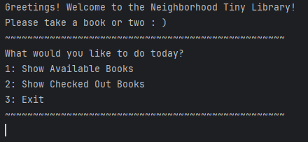
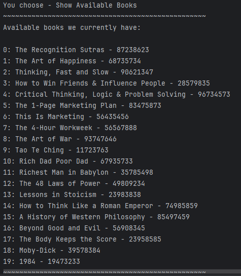
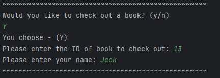
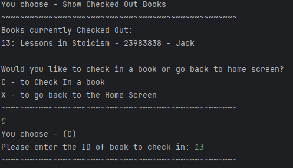
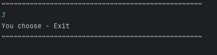

# Neighborhood Library App

---

## Description

The Neighborhood Library App is a simple application that allows users to interact with a 20 book library. 
Users can view available books, check out books, and check in books by returning them.
This library app displays a basic library system where books are managed by their title, ISBN, and ID.

---

## What It Does:

1. **Shows Available Books**  
   Users can view a list of all available books in the library. Each book is displayed with its title, ISBN, and ID. If a book is currently checked out, it will not be shown in the list of available books.

2. **Check Out Books**  
   After viewing the available books, users can select a book to check out by entering its ID. The app will prompt the user for their name, which will be stored as the person who checked out the book.

3. **Shows Checked Out Books**  
   Users can view a list of all books that have been checked out, along with the name of the person who checked out each book.

4. **Check In Books**  
   If a user has checked out a book, they can return it by selecting the book from the list of checked-out books and entering the book's ID to check it back in.

5. **Exit**  
   Users can exit the app by selecting the exit option from the home screen.

---
## Sreenshots

